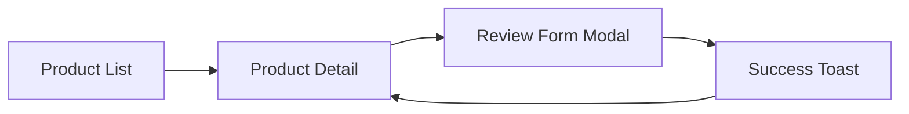

# Specification Format v1.0

Frontend-first, Kiro-compatible spec format. Every feature produces three linked documents.

## Directory Structure

```
.specdrive/
├── config.yaml                    # Project config (stack, workflow mode)
├── product.md                     # Steering: product vision
├── tech-stack.md                  # Steering: Flutter | nextjs | react-native
├── structure.md                   # Steering: folder architecture
├── coding-style.md                # Steering: component/widget conventions
├── specs/
│   └── {feature-slug}/
│       ├── meta.yaml              # Feature metadata, phase gates, approvals
│       ├── requirements.md        # Phase 1: WHAT
│       ├── design.md              # Phase 2: UI/UX HOW
│       ├── tasks.md               # Phase 3: implementation plan
│       └── bugfix.md              # Alternative for bugfix specs
├── decisions/
│   └── 001-use-riverpod.md
└── reviews/
    └── product-review-rev-001.md
```

## meta.yaml

Tracks workflow state and approval gates (Kiro-style gating).

```yaml
specdriveVersion: "1.0"
id: SPEC-001
slug: product-review
title: Product Review Screen
type: feature  # feature | bugfix
stack: flutter
created: 2026-06-30
updated: 2026-06-30
phase: tasks  # requirements | design | tasks | implementing | done
gates:
  requirements:
    status: approved
    approvedAt: 2026-06-30T10:00:00Z
    approvedBy: developer
  design:
    status: approved
    approvedAt: 2026-06-30T11:00:00Z
    approvedBy: developer
  tasks:
    status: approved
    approvedAt: 2026-06-30T12:00:00Z
    approvedBy: developer
requirements: [REQ-001, REQ-002, REQ-003]
tasks: [TASK-001, TASK-002, TASK-003]
```

## requirements.md

Uses **EARS (Easy Approach to Requirements Syntax)** — same notation as Kiro.

### Template

```markdown
---
specdriveVersion: "1.0"
phase: requirements
---

# Requirements: {Feature Title}

## Overview

Brief description of the feature and user value.

## User Stories

### REQ-001: {Story title}

**As a** {role}
**I want** {action}
**So that** {benefit}

#### Acceptance Criteria (EARS)

1. **Ubiquitous:** The system shall display a star rating component on the review form.
2. **Event-driven:** When the user submits a valid review, the system shall save the review and show a success message.
3. **Unwanted event:** If the review text exceeds 500 characters, the system shall prevent submission and show a validation error.
4. **State-driven:** While the review is submitting, the system shall display a loading indicator and disable the submit button.
5. **Optional:** Where the user is logged in, the system shall pre-fill the reviewer name.

#### Edge Cases

- Empty review text
- Network failure on submit
- Offline mode

## Non-Functional Requirements

- Screen shall meet WCAG 2.1 AA contrast requirements
- Form shall be usable with screen reader
- Load time under 200ms on mid-range devices

## Out of Scope

- Review moderation admin panel
- Photo attachments in reviews
```

### EARS patterns

| Pattern | Template | Example |
|---------|----------|---------|
| Ubiquitous | The `<system>` shall `<action>` | The app shall display product images |
| Event-driven | When `<trigger>`, the `<system>` shall `<action>` | When user taps Submit, the app shall validate the form |
| Unwanted | If `<condition>`, then the `<system>` shall `<action>` | If network fails, the app shall show retry option |
| State-driven | While `<state>`, the `<system>` shall `<action>` | While loading, the app shall show skeleton UI |
| Optional | Where `<feature>`, the `<system>` shall `<action>` | Where biometric auth enabled, the app shall offer Face ID |

## design.md

**UI/UX blueprint** — the primary frontend design artifact. Generated from approved `requirements.md` + codebase analysis + steering files.

### Template

```markdown
---
specdriveVersion: "1.0"
phase: design
requirements: [REQ-001, REQ-002, REQ-003]
---

# Design: {Feature Title}

## User Flow



## Screen Map

| Screen | Route / Path | Purpose |
|--------|--------------|---------|
| ProductDetailScreen | `/products/:id` | Show product + reviews |
| ReviewFormModal | modal on ProductDetail | Submit new review |

## Component Hierarchy

```
ProductDetailScreen
├── ProductHeader
├── ProductDescription
├── ReviewList
│   └── ReviewCard (×n)
└── ReviewFormModal
    ├── StarRating
    ├── ReviewTextField
    └── SubmitButton
```

## Component Specifications

### StarRating

| Property | Type | Description |
|----------|------|-------------|
| value | int (1-5) | Current rating |
| onChanged | callback | Rating changed |
| readOnly | bool | Display-only mode |

**States:** default, hovered (web), selected

**Accessibility:** Each star has `Semantics` label "N of 5 stars"

### ReviewFormModal

**States:** idle, validating, submitting, success, error

**Validation:**
- Rating required (REQ-001)
- Text max 500 chars (REQ-003)

## Navigation

| From | To | Type | Trigger |
|------|----|------|---------|
| ProductDetail | ReviewFormModal | Modal | Tap "Write Review" |
| ReviewFormModal | ProductDetail | Dismiss | Submit success / Cancel |

## State Management

| State | Location | Type |
|-------|----------|------|
| reviews list | ReviewNotifier | AsyncNotifier<List<Review>> |
| form state | ReviewFormController | local form state |
| submit status | ReviewFormController | enum: idle/submitting/error |

## Design Tokens

Reference project design system or define overrides:

- Spacing: 8dp grid
- Border radius: 12dp (modal), 8dp (cards)
- Error color: `theme.colorScheme.error`

## Platform Behavior

| Behavior | iOS | Android | Web |
|----------|-----|---------|-----|
| Keyboard | dismiss on tap outside | back closes modal | Enter submits |
| Haptics | light on star tap | — | — |

## API Integration (Client)

| Endpoint | Method | When | Payload |
|----------|--------|------|---------|
| `/api/products/:id/reviews` | GET | Screen load | — |
| `/api/reviews` | POST | Form submit | `{ productId, rating, text } |

## Responsive / Adaptive

- Mobile: full-screen modal
- Tablet+: centered dialog, max-width 480px
- Web: same as tablet

## Requirement Traceability

| Requirement | Design Element |
|-------------|----------------|
| REQ-001 | StarRating component |
| REQ-002 | Submit flow + success toast |
| REQ-003 | ReviewTextField maxLength + validation |
```

## tasks.md

Sequenced implementation tasks linked to requirements. Kiro-style dependency ordering with optional parallel "waves".

### Template

```markdown
---
specdriveVersion: "1.0"
phase: tasks
requirements: [REQ-001, REQ-002, REQ-003]
---

# Tasks: {Feature Title}

## Wave 1 (parallel)

### TASK-001: Scaffold ProductDetailScreen

- **Status:** pending
- **Requirements:** REQ-001
- **Design ref:** Screen Map → ProductDetailScreen
- **Files:** `lib/features/product/presentation/pages/product_detail_page.dart`
- **Acceptance:** Screen renders with placeholder components

### TASK-002: Create StarRating widget

- **Status:** pending
- **Requirements:** REQ-001
- **Design ref:** Component Specifications → StarRating
- **Files:** `lib/features/review/presentation/widgets/star_rating.dart`
- **Acceptance:** Widget tests pass, a11y labels present

## Wave 2 (depends on Wave 1)

### TASK-003: Build ReviewFormModal

- **Status:** pending
- **Requirements:** REQ-002, REQ-003
- **Design ref:** Component Specifications → ReviewFormModal
- **Depends on:** TASK-002
- **Acceptance:** All form states work, validation enforced

### TASK-004: Wire ReviewNotifier + API

- **Status:** pending
- **Requirements:** REQ-002
- **Design ref:** State Management, API Integration
- **Depends on:** TASK-003
- **Acceptance:** Submit saves review, list refreshes

## Wave 3

### TASK-005: Navigation integration

- **Status:** pending
- **Design ref:** Navigation table
- **Depends on:** TASK-001, TASK-003

### TASK-006: Widget tests + a11y audit

- **Status:** pending
- **Requirements:** NFR accessibility
- **Depends on:** TASK-004, TASK-005
```

## bugfix.md

For `spec create --type bugfix`:

```markdown
---
specdriveVersion: "1.0"
type: bugfix
phase: requirements
---

# Bugfix: {Title}

## Observed Behavior

What happens now.

## Expected Behavior

What should happen.

## Reproduction Steps

1. Open Product Detail
2. Scroll review list
3. App crashes

## Root Cause Analysis

(Hypothesis — updated during investigation)

## Fix Approach

Minimal change description.

## Regression Tests

- Test scrolling with 100+ reviews
- Test empty review list
```

Bugfix specs skip full design.md unless UI changes are needed.

## Steering Files

### product.md

Product vision, target users, key features. Read by AI during all generation phases.

### tech-stack.md

```markdown
# Tech Stack

- **Platform:** Flutter 3.x
- **State:** Riverpod
- **Navigation:** go_router
- **HTTP:** dio
- **Testing:** flutter_test, mocktail
```

### structure.md

```markdown
# Project Structure

lib/
├── features/
│   └── {feature}/
│       ├── data/
│       ├── domain/
│       └── presentation/
│           ├── pages/
│           ├── widgets/
│           └── providers/
```

### coding-style.md

Stack-specific conventions. Can be partially provided by stack plugin.

## Schema Validation

Frontmatter validated via JSON Schema in `packages/core/schemas/`. Full schemas implemented in Phase 3.

---

*CLI commands that generate and gate these files: [CLI-SPEC.md](./CLI-SPEC.md).*
